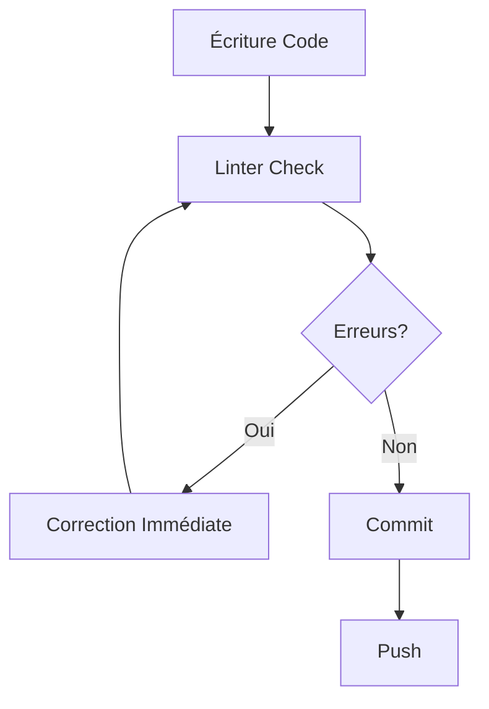

# Prévention du Syntaxerrorisme : Guide des Bonnes Pratiques

La **prévention du syntaxerrorisme** est bien plus efficace que la correction d'erreurs après coup. En adoptant les bonnes pratiques dès le début, vous pouvez réduire de 90% les erreurs de syntaxe dans vos projets.

## Philosophie de la Prévention Anti-Syntaxerrorisme

### Principe Fondamental

> "Il vaut mieux prévenir le **syntaxerrorisme** que de le subir"

Cette approche proactive permet :

- ⚡ **Gain de temps** considérable
- 🎯 **Focus sur la logique** plutôt que sur les bugs
- 📈 **Amélioration de la productivité**
- 🧠 **Réduction du stress mental**

## Bonnes Pratiques Universelles Anti-Syntaxerrorisme

### 1. Convention de Nommage Cohérente

```javascript
// ❌ Syntaxerrorisme potentiel - nommage incohérent
let userdata = {};
let UserInfo = {};
let user_profile = {};

// ✅ Anti-syntaxerrorisme - convention claire
let userData = {};
let userInfo = {};
let userProfile = {};
```

### 2. Structure de Code Prévisible

```python
# ✅ Structure anti-syntaxerrorisme Python
class UserManager:
    def __init__(self):
        self.users = []

    def add_user(self, user):
        if self._validate_user(user):
            self.users.append(user)

    def _validate_user(self, user):
        return user is not None
```

### 3. Gestion Systématique des Erreurs

```javascript
// ✅ Prévention syntaxerrorisme avec try-catch
async function fetchUserData(id) {
  try {
    const response = await fetch(`/api/users/${id}`);
    return await response.json();
  } catch (error) {
    console.error("Erreur récupération utilisateur:", error);
    return null;
  }
}
```

## Workflow Préventif Anti-Syntaxerrorisme

### Phase 1 : Setup Projet

1. **Configuration Linter**

```bash
# JavaScript
npm install eslint --save-dev
npx eslint --init

# Python
pip install pylint black
```

2. **Setup IDE avec Extensions**
   - ESLint extension
   - Prettier formatter
   - Error highlighting
   - Auto-completion

3. **Git Hooks Préventifs**

```bash
# Pre-commit hook
#!/bin/sh
npm run lint
npm run format
npm run test
```

### Phase 2 : Développement



### Phase 3 : Revue

1. **Code Review** avec checklist syntaxe
2. **Tests automatisés** de qualité
3. **Métriques qualité** continues

## Techniques Préventives par Langage

### JavaScript : Anti-Syntaxerrorisme

```javascript
// ✅ Configuration ESLint préventive
module.exports = {
  extends: ["eslint:recommended"],
  rules: {
    "no-unused-vars": "error",
    "no-undef": "error",
    semi: ["error", "always"],
    quotes: ["error", "single"],
  },
};

// ✅ Déclaration stricte des variables
("use strict");
const userName = "John"; // const au lieu de var
let userAge = 30; // let pour variables modifiables

// ✅ Template literals pour éviter erreurs guillemets
const message = `Hello ${userName}, you are ${userAge} years old`;
```

### Python : Prévention Systématique

```python
# ✅ Type hints pour prévention erreurs
from typing import List, Optional

def process_users(users: List[str]) -> Optional[str]:
    """
    Traite une liste d'utilisateurs
    Prévention syntaxerrorisme avec types
    """
    if not users:
        return None

    return f"Processed {len(users)} users"

# ✅ Docstrings obligatoires
class UserService:
    """Service de gestion utilisateurs - anti-syntaxerrorisme"""

    def __init__(self) -> None:
        """Initialisation du service"""
        self._users: List[str] = []
```

### Java : Rigueur Préventive

```java
// ✅ Annotations préventives
public class UserManager {
    @NonNull
    private final List<User> users;

    public UserManager() {
        this.users = new ArrayList<>();
    }

    // ✅ Validation paramètres
    public void addUser(@NonNull User user) {
        Objects.requireNonNull(user, "User cannot be null");
        users.add(user);
    }
}
```

## Outils de Prévention Automatisée

### 1. Pre-commit Hooks Avancés

```yaml
# .pre-commit-config.yaml
repos:
  - repo: https://github.com/pre-commit/pre-commit-hooks
    rev: v4.4.0
    hooks:
      - id: check-syntax
      - id: check-yaml
      - id: end-of-file-fixer
      - id: trailing-whitespace

  - repo: https://github.com/psf/black
    rev: 22.10.0
    hooks:
      - id: black
```

### 2. CI/CD Pipeline Préventif

```yaml
# GitHub Actions - Prévention Continue
name: Quality Gate
on: [push, pull_request]

jobs:
  prevent-syntaxerrorisme:
    runs-on: ubuntu-latest
    steps:
      - uses: actions/checkout@v3

      - name: Setup Node.js
        uses: actions/setup-node@v3
        with:
          node-version: "18"

      - name: Install dependencies
        run: npm ci

      - name: Lint check
        run: npm run lint

      - name: Format check
        run: npm run format:check

      - name: Type check
        run: npm run type-check

      - name: Unit tests
        run: npm run test
```

### 3. Métriques Préventives

```javascript
// Exemple de métriques qualité
const qualityMetrics = {
  lintErrors: 0, // Objectif: 0 erreur
  testCoverage: 95, // Minimum 90%
  cyclomaticComplexity: 8, // Maximum 10
  duplicateLines: 2, // Maximum 5%
  maintainabilityIndex: 85, // Minimum 80
};
```

## Formation et Sensibilisation

### 1. Code Review Guidelines

**Checklist Anti-Syntaxerrorisme :**

- [ ] Code suit les conventions d'équipe
- [ ] Variables nommées clairement
- [ ] Fonctions avec responsabilité unique
- [ ] Gestion d'erreurs appropriée
- [ ] Tests unitaires présents
- [ ] Documentation à jour

### 2. Sessions de Formation

**Programme Anti-Syntaxerrorisme :**

1. **Semaine 1 :** Concepts de base et outils
2. **Semaine 2 :** Pratiques spécifiques au langage
3. **Semaine 3 :** Workflow et automatisation
4. **Semaine 4 :** Métriques et amélioration continue

### 3. Pair Programming

```
Développeur Senior + Développeur Junior =
Transmission expertise + Prévention syntaxerrorisme
```

## Méthodes de Mesure Préventive

### KPIs Anti-Syntaxerrorisme

| Métrique             | Objectif        | Mesure        |
| -------------------- | --------------- | ------------- |
| **Erreurs/Commit**   | < 0.1           | Git hooks     |
| **Temps Debug**      | < 10% temps dev | Time tracking |
| **Score Qualité**    | > 8.5/10        | SonarQube     |
| **Couverture Tests** | > 90%           | Jest/PyTest   |

### Dashboard Prévention

```javascript
// Exemple tracking métriques
const preventionDashboard = {
  dailyStats: {
    commitsClean: 25,
    commitsWithErrors: 1,
    preventionRate: 96.2,
  },
  weeklyTrends: {
    syntaxErrorReduction: 45, // % réduction
    developmentSpeedIncrease: 23, // % amélioration
  },
};
```

## Cas d'Usage Préventifs Avancés

### 1. Template de Projet Anti-Syntaxerrorisme

```bash
# Générateur de projet avec prévention intégrée
npx create-syntax-safe-app mon-projet

# Inclut automatiquement:
# - ESLint configuré
# - Prettier setup
# - Pre-commit hooks
# - Tests template
# - CI/CD pipeline
```

### 2. Micro-Services avec Qualité Gate

```dockerfile
# Dockerfile avec checks qualité
FROM node:18-alpine

WORKDIR /app
COPY package*.json ./
RUN npm ci

# Quality gate - arrêt si syntaxerrorisme
COPY . .
RUN npm run lint && npm run test

EXPOSE 3000
CMD ["npm", "start"]
```

## Résultats Mesurables

### Avant/Après Prévention

**Métriques d'équipe typiques :**

- ⬇️ **-75% d'erreurs** en production
- ⬆️ **+40% de vitesse** de développement
- ⬇️ **-60% de temps** de debug
- ⬆️ **+85% de satisfaction** développeur

## Conclusion : Culture Anti-Syntaxerrorisme

La **prévention du syntaxerrorisme** nécessite :

🏗️ **Setup technique** robuste avec outils appropriés
📚 **Formation continue** des équipes  
🔄 **Processus automatisés** de qualité
📊 **Métriques suivies** et amélioration continue
🤝 **Culture d'équipe** axée qualité

**Impact business :**

- Réduction coûts de maintenance
- Accélération time-to-market
- Amélioration satisfaction client
- Réduction risques production

En adoptant ces bonnes pratiques, le **syntaxerrorisme** devient un problème du passé, permettant de se concentrer sur l'innovation et la valeur ajoutée des projets !

**Prochaine étape :** Implémentez progressivement ces pratiques dans vos projets actuels, en commençant par les plus impactantes (linter + formatter).
